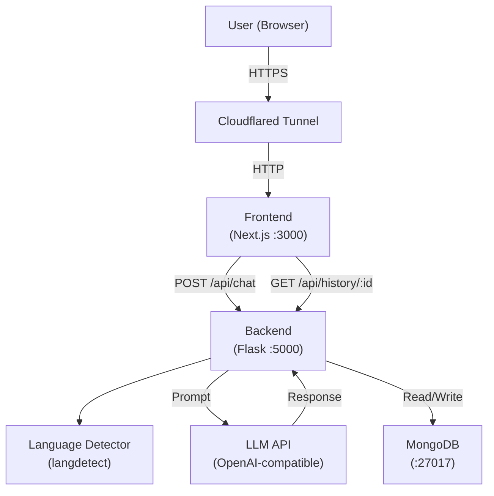

# Design Document: Multilingual Chatbot

## Overview

The multilingual chatbot is a full-stack web application that allows users to converse with an LLM in their native language. The system automatically detects the language of each user message and instructs the LLM to respond in that same language — no user configuration required.

The stack consists of:
- **Next.js** frontend (React-based chat UI)
- **Flask** backend (Python API: language detection, LLM orchestration, persistence)
- **MongoDB** for conversation storage
- **Docker Compose** for orchestration
- **Cloudflared Quick Tunnel** for public internet exposure

The key design principle is a clean separation between the frontend (UI/session management), the backend (business logic), and infrastructure (database, tunnel). Each layer communicates through a well-defined REST API contract.

---

## Architecture



### Request Flow

1. User types a message in the browser; the frontend reads the session ID from `sessionStorage` (generating one if absent) and POSTs to `/api/chat`.
2. The Flask backend receives the request, validates fields, and calls the language detector.
3. The backend constructs a system prompt instructing the LLM to reply in the detected language, then calls the LLM API.
4. The LLM response is optionally truncated, then both the user message and assistant response are persisted to MongoDB.
5. The backend returns `{ response, language, session_id }` to the frontend.
6. The frontend appends both messages to the chat display and scrolls to the bottom.

---

## Components and Interfaces

### Frontend Components

#### `ChatPage` (page component)
- Manages session ID lifecycle (read/write `sessionStorage`)
- Holds `messages` state array and `loading` boolean
- Renders `MessageList`, `InputBar`

#### `MessageList`
- Renders a scrollable list of `MessageBubble` components
- Auto-scrolls to the latest message via a `useEffect` + ref

#### `MessageBubble`
- Renders a single message with role-based styling (user vs assistant)
- Displays detected language code badge on assistant messages

#### `InputBar`
- Controlled text input + send button
- Disables send and shows spinner while `loading === true`
- Prevents submission when input is empty; shows inline validation

#### `api.ts` (client utility)
- `sendMessage(sessionId, message): Promise<ChatResponse>` — wraps the POST `/api/chat` call
- `getHistory(sessionId): Promise<Message[]>` — wraps the GET `/api/history/:id` call

### Backend Modules

#### `app.py` — Flask application entry point
- Registers blueprints, reads env vars at startup, exits on missing required vars

#### `routes/chat.py` — Chat endpoint
- `POST /api/chat` — validates body, calls `language_detector`, calls `llm_client`, calls `conversation_store`, returns response
- `GET /api/health` — returns `{"status": "ok"}`

#### `routes/history.py`
- `GET /api/history/<session_id>` — queries MongoDB, returns messages in chronological order

#### `services/language_detector.py`
- `detect(text: str) -> str` — wraps `langdetect.detect()`, returns BCP 47 language code, falls back to `"en"` on low-confidence or exception

#### `services/llm_client.py`
- `generate(prompt: str, language: str) -> str` — builds system + user messages, calls OpenAI-compatible API via `LLM_API_KEY`, truncates response to 2000 chars if needed

#### `services/conversation_store.py`
- `save_message(session_id, role, text, language, timestamp)` — inserts a document into the `messages` collection; logs and swallows DB errors so the request never fails due to persistence issues
- `get_messages(session_id) -> list` — returns all messages for a session sorted by timestamp ascending

### REST API Contract

| Method | Path | Request | Response |
|--------|------|---------|----------|
| POST | `/api/chat` | `{ session_id, message }` | `200: { response, language, session_id }` / `400: { error }` / `503: { error }` |
| GET | `/api/history/{session_id}` | — | `200: [ { role, text, language, timestamp } ]` |
| GET | `/api/health` | — | `200: { status: "ok" }` |

---

## Data Models

### MongoDB: `messages` collection

```json
{
  "_id": "ObjectId (auto)",
  "session_id": "string (UUID v4)",
  "role": "user | assistant",
  "text": "string",
  "language": "string (BCP 47, e.g. 'en', 'fr')",
  "timestamp": "ISODate (UTC)"
}
```

An index on `{ session_id: 1, timestamp: 1 }` supports efficient history retrieval.

### Frontend: In-memory message state

```typescript
interface Message {
  id: string;          // client-generated UUID for React key
  role: "user" | "assistant";
  text: string;
  language?: string;   // only present on assistant messages
  timestamp: number;   // Date.now()
}
```

### API Payloads

**POST `/api/chat` request:**
```json
{ "session_id": "uuid-v4", "message": "Bonjour, comment ça va?" }
```

**POST `/api/chat` response (200):**
```json
{ "response": "Ça va bien, merci!", "language": "fr", "session_id": "uuid-v4" }
```

**GET `/api/history/{session_id}` response (200):**
```json
[
  { "role": "user", "text": "Bonjour", "language": "fr", "timestamp": "2024-01-01T12:00:00Z" },
  { "role": "assistant", "text": "Bonjour!", "language": "fr", "timestamp": "2024-01-01T12:00:01Z" }
]
```

### Environment Variables

| Variable | Service | Required | Description |
|----------|---------|----------|-------------|
| `LLM_API_KEY` | Backend | Yes* | API key for OpenAI-compatible LLM |
| `LLM_MODEL_PATH` | Backend | Yes* | Path/name of local model (alternative to API key) |
| `MONGODB_URI` | Backend | Yes | MongoDB connection string |
| `NEXT_PUBLIC_API_URL` | Frontend | No | Backend base URL (defaults to `http://localhost:5000`) |

*At least one of `LLM_API_KEY` or `LLM_MODEL_PATH` must be set.

---

